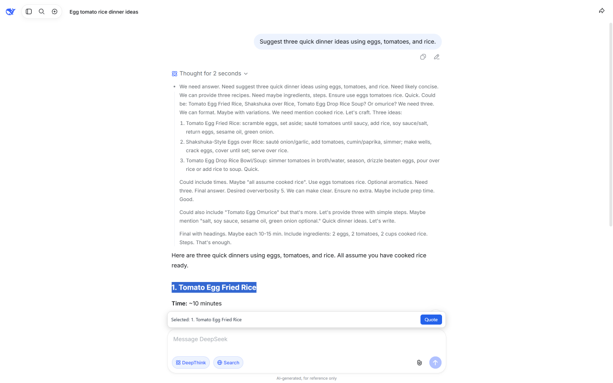
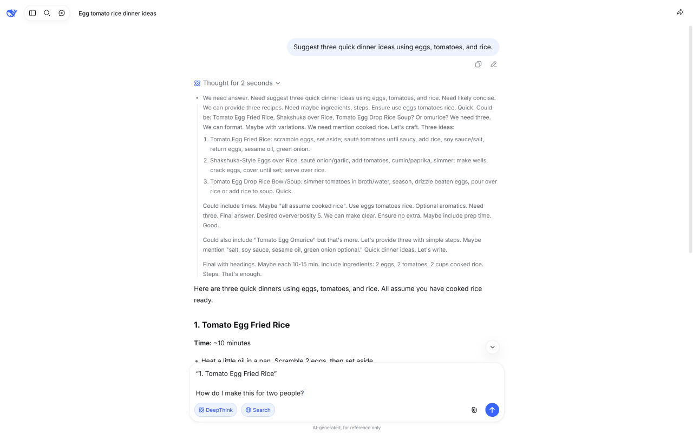

<p align="center">
  
</p>

<h1 align="center">DeepSeek Enhancer</h1>

<p align="center">
  <a href="https://github.com/jiang1997/chrome-deepseek-enchance-plugin/actions/workflows/ci.yml"></a>
  <a href="https://github.com/jiang1997/chrome-deepseek-enchance-plugin/releases"></a>
  <a href="LICENSE"></a>
</p>

Select text in a DeepSeek response and quote it into the composer to keep asking. The extension runs locally and does not upload chat content.

## How it works

1. Select text in a response on `https://chat.deepseek.com/`.
2. A prompt matching the composer's width appears directly above the composer, with a saved preview, a Quote button, and a × close button.
3. Click the composer and write your follow-up. Clearing the selection or clicking elsewhere keeps the pending quote; a new valid selection replaces it.
4. Click Quote. The saved text is appended to your current draft as `“selected text”`, with the cursor after the quote. The prompt closes after a successful insertion; failures keep the preview for retry.
5. Keep typing, edit the quote, and send the message yourself. Existing draft text is preserved. Click × or press Escape to discard a pending quote without changing your draft.

The preview is retained when switching browser tabs or when the composer temporarily leaves the viewport, and returns when the composer is visible again. Switching conversations or refreshing the page clears pending quotes.

When the selection sits inside a conversation message, the quote also records where it came from, so the model can tell your words from its own:

```text
[Quote · assistant #2]
“A closure keeps the lexical environment it could access when it was created.”
```

Role is read from the page's message content classes. Ordinals are counted in DOM order only when the virtual list explicitly renders from the first message; message IDs are never treated as positions. When the ordinal cannot be determined, the label contains only `AI` or `You`. Selections spanning multiple messages, or with an unknown role, fall back to plain `“selected text”`.

## Screenshots

| 1. Select & Quote | 2. Ask a Follow-up |
| :---: | :---: |
| [](store-assets/screenshots/01-select-and-quote.png) | [](store-assets/screenshots/02-follow-up-draft.png) |
| Select text in a response, then click **Quote**. | Add your follow-up question to the quoted draft. |

Click either screenshot to view the full-size image.

## Install from a ZIP file

```sh
npm install
npm run pack:zip
```

The output is `release/deepseek-enhancer-<version>-unpacked.zip` (ignored by Git). To install it:

1. Extract the ZIP file to a permanent directory.
2. Open `chrome://extensions` and enable **Developer mode**.
3. Click **Load unpacked**.
4. Select the extracted directory that directly contains `manifest.json`.

Keep the extracted directory in place after installation.

## Install from source

```sh
npm install
npm run build
```

Then use **Load unpacked** in `chrome://extensions` and select the generated `dist/` directory.

## Check the extension

- Select text in a response, including a list or code block. A prompt should appear above the composer.
- The prompt preview shows the source badge (for example `Selected assistant #2: ...`) when it can be resolved.
- Click Quote. The composer appends the labelled quote; the cursor stays after it.
- Quoting your own earlier message labels it as `user #N`.
- Existing draft text stays intact. You can keep typing, edit, and send manually.
- Clearing the selection, clicking elsewhere, and editing the draft keep the pending preview. Click × or press Escape to dismiss it.
- Scrolling and resizing keep the prompt aligned; it returns after the composer comes back into view. Changing chats clears it.
- Selecting text inside the composer does not replace a pending quote. Selections over 5,000 characters show a hint and preserve any previous preview.

`fixtures/mock-chat.html` provides a mock conversation for local checks. `npm run inspect:deepseek` runs a read-only diagnostic against the live DeepSeek page (reachability plus composer candidates); it loads no extension and asserts no quote behavior.

Verified so far: real-page quote flow and English UI. Not yet fully covered: every zoom level, every editor branch, and the full dark/light regression matrix.

## Development commands

- `npm test`: run unit tests with Vitest.
- `npm run typecheck`: check TypeScript types.
- `npm run build`: create the production extension in `dist/`.
- `npm run inspect:deepseek`: diagnose the live DeepSeek page structure; screenshots go to `artifacts/`.
- `npm run pack:zip`: build the store upload ZIP.

Store listing sources, screenshots, and release steps: `store-assets/README.md`.

Automated store upload and review submission: [GitHub Actions publishing guide](store-assets/automated-publishing.md).

## Optional local CRX

For managed or automated local distribution only; the Chrome Web Store does not need it:

```sh
npm run init:crx-key
npm run pack:crx
```

The private key at `keys/deepseek-enhancer.pem` is gitignored. Back it up; losing it changes the extension ID for CRX installs. Store signing is managed separately by Google.

## Privacy

The content script runs only on `chat.deepseek.com`. The extension requests no tabs, storage, cookies, or network permissions. Selected text and the existing draft are processed locally for the quote feature. The extension does not transmit this content to the developer or persist it in storage.

Privacy policy: https://jiang1997.github.io/chrome-deepseek-enchance-plugin/privacy.html

## Limitations

DeepSeek may change its composer or page structure. Dark mode and browser zoom still need full manual regression coverage. Message role detection depends on DeepSeek's message-list DOM; it degrades to an unlabelled quote if those hooks change. Ordinals are omitted when earlier messages are unmounted, a preceding role is unknown, or the virtual-list window offset is unavailable.
